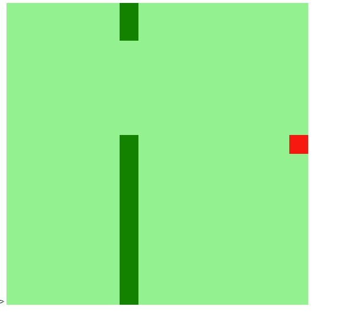

# Recriando o jogo da cobrinha em JS 
- Este Projeto é parte integrante do curso Sp Tech Desenvolvimento Front-end.Nele recriamos o famoso jogo da cobrinha em Javascript:  
- Para clonar o projeto : 
```
git clone https://github.com/luizrosalba/jogoCobrinhaemJS
``` 
Para executá-lo basta abrir o arquivo index.html


